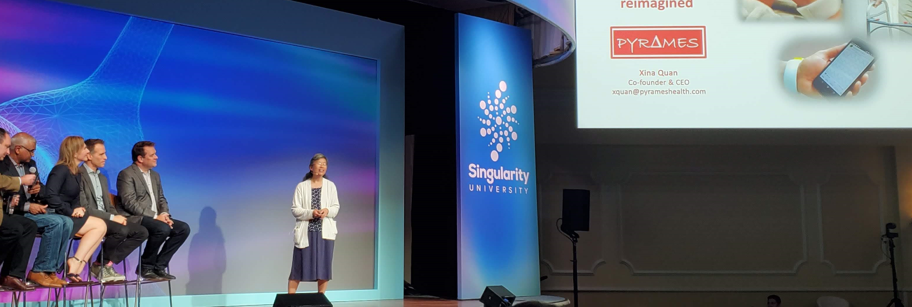
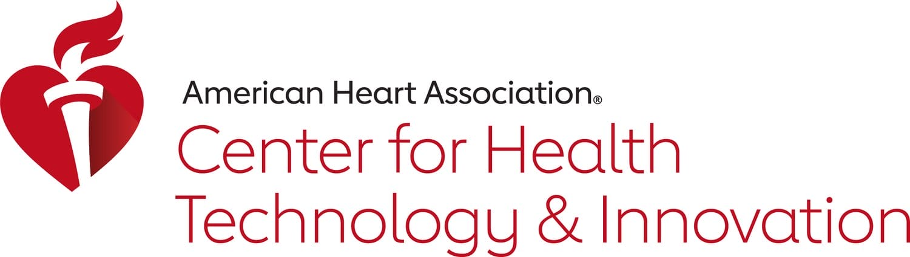

       Blood pressure monitors - PyrAmes Health               {"@context":"https://schema.org","@graph":\[{"@type":"WebPage","@id":"https://pyrameshealth.com/","url":"https://pyrameshealth.com/","name":"Blood pressure monitors - PyrAmes Health","isPartOf":{"@id":"https://pyrameshealth.com/#website"},"about":{"@id":"https://pyrameshealth.com/#organization"},"primaryImageOfPage":{"@id":"https://pyrameshealth.com/#primaryimage"},"image":{"@id":"https://pyrameshealth.com/#primaryimage"},"thumbnailUrl":"https://pyrameshealth.com/wp-content/uploads/2021/04/PyrAmes-Home-t.jpg","datePublished":"2021-04-07T14:01:00+00:00","dateModified":"2024-06-11T19:23:07+00:00","description":"PyrAmes's range of blood pressure monitors is accurate, inconspicuous, wireless BP monitoring for newborns to seniors of all ages patients. Order now!","breadcrumb":{"@id":"https://pyrameshealth.com/#breadcrumb"},"inLanguage":"en-US","potentialAction":\[{"@type":"ReadAction","target":\["https://pyrameshealth.com/"\]}\]},{"@type":"ImageObject","inLanguage":"en-US","@id":"https://pyrameshealth.com/#primaryimage","url":"https://pyrameshealth.com/wp-content/uploads/2021/04/PyrAmes-Home-t.jpg","contentUrl":"https://pyrameshealth.com/wp-content/uploads/2021/04/PyrAmes-Home-t.jpg","width":1075,"height":580,"caption":"PyrAmes-Home-t"},{"@type":"BreadcrumbList","@id":"https://pyrameshealth.com/#breadcrumb","itemListElement":\[{"@type":"ListItem","position":1,"name":"Home"}\]},{"@type":"WebSite","@id":"https://pyrameshealth.com/#website","url":"https://pyrameshealth.com/","name":"PyrAmes","description":"Vital data, innovative care.","publisher":{"@id":"https://pyrameshealth.com/#organization"},"potentialAction":\[{"@type":"SearchAction","target":{"@type":"EntryPoint","urlTemplate":"https://pyrameshealth.com/?s={search\_term\_string}"},"query-input":"required name=search\_term\_string"}\],"inLanguage":"en-US"},{"@type":"Organization","@id":"https://pyrameshealth.com/#organization","name":"PyrAmes","url":"https://pyrameshealth.com/","logo":{"@type":"ImageObject","inLanguage":"en-US","@id":"https://pyrameshealth.com/#/schema/logo/image/","url":"https://pyrameshealth.com/wp-content/uploads/2022/03/cropped-PyrAmes\_Logo\_new\_small-4.jpg","contentUrl":"https://pyrameshealth.com/wp-content/uploads/2022/03/cropped-PyrAmes\_Logo\_new\_small-4.jpg","width":459,"height":135,"caption":"PyrAmes"},"image":{"@id":"https://pyrameshealth.com/#/schema/logo/image/"}}\]}       var mi\_version = '8.27.0'; var mi\_track\_user = true; var mi\_no\_track\_reason = ''; var MonsterInsightsDefaultLocations = {"page\_location":"https:\\/\\/pyrameshealth.com\\/"}; if ( typeof MonsterInsightsPrivacyGuardFilter === 'function' ) { var MonsterInsightsLocations = (typeof MonsterInsightsExcludeQuery === 'object') ? MonsterInsightsPrivacyGuardFilter( MonsterInsightsExcludeQuery ) : MonsterInsightsPrivacyGuardFilter( MonsterInsightsDefaultLocations ); } else { var MonsterInsightsLocations = (typeof MonsterInsightsExcludeQuery === 'object') ? MonsterInsightsExcludeQuery : MonsterInsightsDefaultLocations; } var disableStrs = \[ 'ga-disable-G-GF9C30DPKV', \]; /\* Function to detect opted out users \*/ function \_\_gtagTrackerIsOptedOut() { for (var index = 0; index < disableStrs.length; index++) { if (document.cookie.indexOf(disableStrs\[index\] + '=true') > -1) { return true; } } return false; } /\* Disable tracking if the opt-out cookie exists. \*/ if (\_\_gtagTrackerIsOptedOut()) { for (var index = 0; index < disableStrs.length; index++) { window\[disableStrs\[index\]\] = true; } } /\* Opt-out function \*/ function \_\_gtagTrackerOptout() { for (var index = 0; index < disableStrs.length; index++) { document.cookie = disableStrs\[index\] + '=true; expires=Thu, 31 Dec 2099 23:59:59 UTC; path=/'; window\[disableStrs\[index\]\] = true; } } if ('undefined' === typeof gaOptout) { function gaOptout() { \_\_gtagTrackerOptout(); } } window.dataLayer = window.dataLayer || \[\]; window.MonsterInsightsDualTracker = { helpers: {}, trackers: {}, }; if (mi\_track\_user) { function \_\_gtagDataLayer() { dataLayer.push(arguments); } function \_\_gtagTracker(type, name, parameters) { if (!parameters) { parameters = {}; } if (parameters.send\_to) { \_\_gtagDataLayer.apply(null, arguments); return; } if (type === 'event') { parameters.send\_to = monsterinsights\_frontend.v4\_id; var hookName = name; if (typeof parameters\['event\_category'\] !== 'undefined') { hookName = parameters\['event\_category'\] + ':' + name; } if (typeof MonsterInsightsDualTracker.trackers\[hookName\] !== 'undefined') { MonsterInsightsDualTracker.trackers\[hookName\](parameters); } else { \_\_gtagDataLayer('event', name, parameters); } } else { \_\_gtagDataLayer.apply(null, arguments); } } \_\_gtagTracker('js', new Date()); \_\_gtagTracker('set', { 'developer\_id.dZGIzZG': true, }); if ( MonsterInsightsLocations.page\_location ) { \_\_gtagTracker('set', MonsterInsightsLocations); } \_\_gtagTracker('config', 'G-GF9C30DPKV', {"forceSSL":"true","link\_attribution":"true"} ); window.gtag = \_\_gtagTracker; (function () { /\* https://developers.google.com/analytics/devguides/collection/analyticsjs/ \*/ /\* ga and \_\_gaTracker compatibility shim. \*/ var noopfn = function () { return null; }; var newtracker = function () { return new Tracker(); }; var Tracker = function () { return null; }; var p = Tracker.prototype; p.get = noopfn; p.set = noopfn; p.send = function () { var args = Array.prototype.slice.call(arguments); args.unshift('send'); \_\_gaTracker.apply(null, args); }; var \_\_gaTracker = function () { var len = arguments.length; if (len === 0) { return; } var f = arguments\[len - 1\]; if (typeof f !== 'object' || f === null || typeof f.hitCallback !== 'function') { if ('send' === arguments\[0\]) { var hitConverted, hitObject = false, action; if ('event' === arguments\[1\]) { if ('undefined' !== typeof arguments\[3\]) { hitObject = { 'eventAction': arguments\[3\], 'eventCategory': arguments\[2\], 'eventLabel': arguments\[4\], 'value': arguments\[5\] ? arguments\[5\] : 1, } } } if ('pageview' === arguments\[1\]) { if ('undefined' !== typeof arguments\[2\]) { hitObject = { 'eventAction': 'page\_view', 'page\_path': arguments\[2\], } } } if (typeof arguments\[2\] === 'object') { hitObject = arguments\[2\]; } if (typeof arguments\[5\] === 'object') { Object.assign(hitObject, arguments\[5\]); } if ('undefined' !== typeof arguments\[1\].hitType) { hitObject = arguments\[1\]; if ('pageview' === hitObject.hitType) { hitObject.eventAction = 'page\_view'; } } if (hitObject) { action = 'timing' === arguments\[1\].hitType ? 'timing\_complete' : hitObject.eventAction; hitConverted = mapArgs(hitObject); \_\_gtagTracker('event', action, hitConverted); } } return; } function mapArgs(args) { var arg, hit = {}; var gaMap = { 'eventCategory': 'event\_category', 'eventAction': 'event\_action', 'eventLabel': 'event\_label', 'eventValue': 'event\_value', 'nonInteraction': 'non\_interaction', 'timingCategory': 'event\_category', 'timingVar': 'name', 'timingValue': 'value', 'timingLabel': 'event\_label', 'page': 'page\_path', 'location': 'page\_location', 'title': 'page\_title', 'referrer' : 'page\_referrer', }; for (arg in args) { if (!(!args.hasOwnProperty(arg) || !gaMap.hasOwnProperty(arg))) { hit\[gaMap\[arg\]\] = args\[arg\]; } else { hit\[arg\] = args\[arg\]; } } return hit; } try { f.hitCallback(); } catch (ex) { } }; \_\_gaTracker.create = newtracker; \_\_gaTracker.getByName = newtracker; \_\_gaTracker.getAll = function () { return \[\]; }; \_\_gaTracker.remove = noopfn; \_\_gaTracker.loaded = true; window\['\_\_gaTracker'\] = \_\_gaTracker; })(); } else { console.log(""); (function () { function \_\_gtagTracker() { return null; } window\['\_\_gtagTracker'\] = \_\_gtagTracker; window\['gtag'\] = \_\_gtagTracker; })(); } window.\_wpemojiSettings = {"baseUrl":"https:\\/\\/s.w.org\\/images\\/core\\/emoji\\/15.0.3\\/72x72\\/","ext":".png","svgUrl":"https:\\/\\/s.w.org\\/images\\/core\\/emoji\\/15.0.3\\/svg\\/","svgExt":".svg","source":{"concatemoji":"https:\\/\\/pyrameshealth.com\\/wp-includes\\/js\\/wp-emoji-release.min.js?ver=6.5.3"}}; /\*! This file is auto-generated \*/ !function(i,n){var o,s,e;function c(e){try{var t={supportTests:e,timestamp:(new Date).valueOf()};sessionStorage.setItem(o,JSON.stringify(t))}catch(e){}}function p(e,t,n){e.clearRect(0,0,e.canvas.width,e.canvas.height),e.fillText(t,0,0);var t=new Uint32Array(e.getImageData(0,0,e.canvas.width,e.canvas.height).data),r=(e.clearRect(0,0,e.canvas.width,e.canvas.height),e.fillText(n,0,0),new Uint32Array(e.getImageData(0,0,e.canvas.width,e.canvas.height).data));return t.every(function(e,t){return e===r\[t\]})}function u(e,t,n){switch(t){case"flag":return n(e,"\\ud83c\\udff3\\ufe0f\\u200d\\u26a7\\ufe0f","\\ud83c\\udff3\\ufe0f\\u200b\\u26a7\\ufe0f")?!1:!n(e,"\\ud83c\\uddfa\\ud83c\\uddf3","\\ud83c\\uddfa\\u200b\\ud83c\\uddf3")&&!n(e,"\\ud83c\\udff4\\udb40\\udc67\\udb40\\udc62\\udb40\\udc65\\udb40\\udc6e\\udb40\\udc67\\udb40\\udc7f","\\ud83c\\udff4\\u200b\\udb40\\udc67\\u200b\\udb40\\udc62\\u200b\\udb40\\udc65\\u200b\\udb40\\udc6e\\u200b\\udb40\\udc67\\u200b\\udb40\\udc7f");case"emoji":return!n(e,"\\ud83d\\udc26\\u200d\\u2b1b","\\ud83d\\udc26\\u200b\\u2b1b")}return!1}function f(e,t,n){var r="undefined"!=typeof WorkerGlobalScope&&self instanceof WorkerGlobalScope?new OffscreenCanvas(300,150):i.createElement("canvas"),a=r.getContext("2d",{willReadFrequently:!0}),o=(a.textBaseline="top",a.font="600 32px Arial",{});return e.forEach(function(e){o\[e\]=t(a,e,n)}),o}function t(e){var t=i.createElement("script");t.src=e,t.defer=!0,i.head.appendChild(t)}"undefined"!=typeof Promise&&(o="wpEmojiSettingsSupports",s=\["flag","emoji"\],n.supports={everything:!0,everythingExceptFlag:!0},e=new Promise(function(e){i.addEventListener("DOMContentLoaded",e,{once:!0})}),new Promise(function(t){var n=function(){try{var e=JSON.parse(sessionStorage.getItem(o));if("object"==typeof e&&"number"==typeof e.timestamp&&(new Date).valueOf()<e.timestamp+604800&&"object"==typeof e.supportTests)return e.supportTests}catch(e){}return null}();if(!n){if("undefined"!=typeof Worker&&"undefined"!=typeof OffscreenCanvas&&"undefined"!=typeof URL&&URL.createObjectURL&&"undefined"!=typeof Blob)try{var e="postMessage("+f.toString()+"("+\[JSON.stringify(s),u.toString(),p.toString()\].join(",")+"));",r=new Blob(\[e\],{type:"text/javascript"}),a=new Worker(URL.createObjectURL(r),{name:"wpTestEmojiSupports"});return void(a.onmessage=function(e){c(n=e.data),a.terminate(),t(n)})}catch(e){}c(n=f(s,u,p))}t(n)}).then(function(e){for(var t in e)n.supports\[t\]=e\[t\],n.supports.everything=n.supports.everything&&n.supports\[t\],"flag"!==t&&(n.supports.everythingExceptFlag=n.supports.everythingExceptFlag&&n.supports\[t\]);n.supports.everythingExceptFlag=n.supports.everythingExceptFlag&&!n.supports.flag,n.DOMReady=!1,n.readyCallback=function(){n.DOMReady=!0}}).then(function(){return e}).then(function(){var e;n.supports.everything||(n.readyCallback(),(e=n.source||{}).concatemoji?t(e.concatemoji):e.wpemoji&&e.twemoji&&(t(e.twemoji),t(e.wpemoji)))}))}((window,document),window.\_wpemojiSettings); img.wp-smiley, img.emoji { display: inline !important; border: none !important; box-shadow: none !important; height: 1em !important; width: 1em !important; margin: 0 0.07em !important; vertical-align: -0.1em !important; background: none !important; padding: 0 !important; }  /\*! This file is auto-generated \*/ .wp-block-button\_\_link{color:#fff;background-color:#32373c;border-radius:9999px;box-shadow:none;text-decoration:none;padding:calc(.667em + 2px) calc(1.333em + 2px);font-size:1.125em}.wp-block-file\_\_button{background:#32373c;color:#fff;text-decoration:none} body{--wp--preset--color--black: #000000;--wp--preset--color--cyan-bluish-gray: #abb8c3;--wp--preset--color--white: #ffffff;--wp--preset--color--pale-pink: #f78da7;--wp--preset--color--vivid-red: #cf2e2e;--wp--preset--color--luminous-vivid-orange: #ff6900;--wp--preset--color--luminous-vivid-amber: #fcb900;--wp--preset--color--light-green-cyan: #7bdcb5;--wp--preset--color--vivid-green-cyan: #00d084;--wp--preset--color--pale-cyan-blue: #8ed1fc;--wp--preset--color--vivid-cyan-blue: #0693e3;--wp--preset--color--vivid-purple: #9b51e0;--wp--preset--gradient--vivid-cyan-blue-to-vivid-purple: linear-gradient(135deg,rgba(6,147,227,1) 0%,rgb(155,81,224) 100%);--wp--preset--gradient--light-green-cyan-to-vivid-green-cyan: linear-gradient(135deg,rgb(122,220,180) 0%,rgb(0,208,130) 100%);--wp--preset--gradient--luminous-vivid-amber-to-luminous-vivid-orange: linear-gradient(135deg,rgba(252,185,0,1) 0%,rgba(255,105,0,1) 100%);--wp--preset--gradient--luminous-vivid-orange-to-vivid-red: linear-gradient(135deg,rgba(255,105,0,1) 0%,rgb(207,46,46) 100%);--wp--preset--gradient--very-light-gray-to-cyan-bluish-gray: linear-gradient(135deg,rgb(238,238,238) 0%,rgb(169,184,195) 100%);--wp--preset--gradient--cool-to-warm-spectrum: linear-gradient(135deg,rgb(74,234,220) 0%,rgb(151,120,209) 20%,rgb(207,42,186) 40%,rgb(238,44,130) 60%,rgb(251,105,98) 80%,rgb(254,248,76) 100%);--wp--preset--gradient--blush-light-purple: linear-gradient(135deg,rgb(255,206,236) 0%,rgb(152,150,240) 100%);--wp--preset--gradient--blush-bordeaux: linear-gradient(135deg,rgb(254,205,165) 0%,rgb(254,45,45) 50%,rgb(107,0,62) 100%);--wp--preset--gradient--luminous-dusk: linear-gradient(135deg,rgb(255,203,112) 0%,rgb(199,81,192) 50%,rgb(65,88,208) 100%);--wp--preset--gradient--pale-ocean: linear-gradient(135deg,rgb(255,245,203) 0%,rgb(182,227,212) 50%,rgb(51,167,181) 100%);--wp--preset--gradient--electric-grass: linear-gradient(135deg,rgb(202,248,128) 0%,rgb(113,206,126) 100%);--wp--preset--gradient--midnight: linear-gradient(135deg,rgb(2,3,129) 0%,rgb(40,116,252) 100%);--wp--preset--font-size--small: 13px;--wp--preset--font-size--medium: 20px;--wp--preset--font-size--large: 36px;--wp--preset--font-size--x-large: 42px;--wp--preset--spacing--20: 0.44rem;--wp--preset--spacing--30: 0.67rem;--wp--preset--spacing--40: 1rem;--wp--preset--spacing--50: 1.5rem;--wp--preset--spacing--60: 2.25rem;--wp--preset--spacing--70: 3.38rem;--wp--preset--spacing--80: 5.06rem;--wp--preset--shadow--natural: 6px 6px 9px rgba(0, 0, 0, 0.2);--wp--preset--shadow--deep: 12px 12px 50px rgba(0, 0, 0, 0.4);--wp--preset--shadow--sharp: 6px 6px 0px rgba(0, 0, 0, 0.2);--wp--preset--shadow--outlined: 6px 6px 0px -3px rgba(255, 255, 255, 1), 6px 6px rgba(0, 0, 0, 1);--wp--preset--shadow--crisp: 6px 6px 0px rgba(0, 0, 0, 1);}:where(.is-layout-flex){gap: 0.5em;}:where(.is-layout-grid){gap: 0.5em;}body .is-layout-flex{display: flex;}body .is-layout-flex{flex-wrap: wrap;align-items: center;}body .is-layout-flex > \*{margin: 0;}body .is-layout-grid{display: grid;}body .is-layout-grid > \*{margin: 0;}:where(.wp-block-columns.is-layout-flex){gap: 2em;}:where(.wp-block-columns.is-layout-grid){gap: 2em;}:where(.wp-block-post-template.is-layout-flex){gap: 1.25em;}:where(.wp-block-post-template.is-layout-grid){gap: 1.25em;}.has-black-color{color: var(--wp--preset--color--black) !important;}.has-cyan-bluish-gray-color{color: var(--wp--preset--color--cyan-bluish-gray) !important;}.has-white-color{color: var(--wp--preset--color--white) !important;}.has-pale-pink-color{color: var(--wp--preset--color--pale-pink) !important;}.has-vivid-red-color{color: var(--wp--preset--color--vivid-red) !important;}.has-luminous-vivid-orange-color{color: var(--wp--preset--color--luminous-vivid-orange) !important;}.has-luminous-vivid-amber-color{color: var(--wp--preset--color--luminous-vivid-amber) !important;}.has-light-green-cyan-color{color: var(--wp--preset--color--light-green-cyan) !important;}.has-vivid-green-cyan-color{color: var(--wp--preset--color--vivid-green-cyan) !important;}.has-pale-cyan-blue-color{color: var(--wp--preset--color--pale-cyan-blue) !important;}.has-vivid-cyan-blue-color{color: var(--wp--preset--color--vivid-cyan-blue) !important;}.has-vivid-purple-color{color: var(--wp--preset--color--vivid-purple) !important;}.has-black-background-color{background-color: var(--wp--preset--color--black) !important;}.has-cyan-bluish-gray-background-color{background-color: var(--wp--preset--color--cyan-bluish-gray) !important;}.has-white-background-color{background-color: var(--wp--preset--color--white) !important;}.has-pale-pink-background-color{background-color: var(--wp--preset--color--pale-pink) !important;}.has-vivid-red-background-color{background-color: var(--wp--preset--color--vivid-red) !important;}.has-luminous-vivid-orange-background-color{background-color: var(--wp--preset--color--luminous-vivid-orange) !important;}.has-luminous-vivid-amber-background-color{background-color: var(--wp--preset--color--luminous-vivid-amber) !important;}.has-light-green-cyan-background-color{background-color: var(--wp--preset--color--light-green-cyan) !important;}.has-vivid-green-cyan-background-color{background-color: var(--wp--preset--color--vivid-green-cyan) !important;}.has-pale-cyan-blue-background-color{background-color: var(--wp--preset--color--pale-cyan-blue) !important;}.has-vivid-cyan-blue-background-color{background-color: var(--wp--preset--color--vivid-cyan-blue) !important;}.has-vivid-purple-background-color{background-color: var(--wp--preset--color--vivid-purple) !important;}.has-black-border-color{border-color: var(--wp--preset--color--black) !important;}.has-cyan-bluish-gray-border-color{border-color: var(--wp--preset--color--cyan-bluish-gray) !important;}.has-white-border-color{border-color: var(--wp--preset--color--white) !important;}.has-pale-pink-border-color{border-color: var(--wp--preset--color--pale-pink) !important;}.has-vivid-red-border-color{border-color: var(--wp--preset--color--vivid-red) !important;}.has-luminous-vivid-orange-border-color{border-color: var(--wp--preset--color--luminous-vivid-orange) !important;}.has-luminous-vivid-amber-border-color{border-color: var(--wp--preset--color--luminous-vivid-amber) !important;}.has-light-green-cyan-border-color{border-color: var(--wp--preset--color--light-green-cyan) !important;}.has-vivid-green-cyan-border-color{border-color: var(--wp--preset--color--vivid-green-cyan) !important;}.has-pale-cyan-blue-border-color{border-color: var(--wp--preset--color--pale-cyan-blue) !important;}.has-vivid-cyan-blue-border-color{border-color: var(--wp--preset--color--vivid-cyan-blue) !important;}.has-vivid-purple-border-color{border-color: var(--wp--preset--color--vivid-purple) !important;}.has-vivid-cyan-blue-to-vivid-purple-gradient-background{background: var(--wp--preset--gradient--vivid-cyan-blue-to-vivid-purple) !important;}.has-light-green-cyan-to-vivid-green-cyan-gradient-background{background: var(--wp--preset--gradient--light-green-cyan-to-vivid-green-cyan) !important;}.has-luminous-vivid-amber-to-luminous-vivid-orange-gradient-background{background: var(--wp--preset--gradient--luminous-vivid-amber-to-luminous-vivid-orange) !important;}.has-luminous-vivid-orange-to-vivid-red-gradient-background{background: var(--wp--preset--gradient--luminous-vivid-orange-to-vivid-red) !important;}.has-very-light-gray-to-cyan-bluish-gray-gradient-background{background: var(--wp--preset--gradient--very-light-gray-to-cyan-bluish-gray) !important;}.has-cool-to-warm-spectrum-gradient-background{background: var(--wp--preset--gradient--cool-to-warm-spectrum) !important;}.has-blush-light-purple-gradient-background{background: var(--wp--preset--gradient--blush-light-purple) !important;}.has-blush-bordeaux-gradient-background{background: var(--wp--preset--gradient--blush-bordeaux) !important;}.has-luminous-dusk-gradient-background{background: var(--wp--preset--gradient--luminous-dusk) !important;}.has-pale-ocean-gradient-background{background: var(--wp--preset--gradient--pale-ocean) !important;}.has-electric-grass-gradient-background{background: var(--wp--preset--gradient--electric-grass) !important;}.has-midnight-gradient-background{background: var(--wp--preset--gradient--midnight) !important;}.has-small-font-size{font-size: var(--wp--preset--font-size--small) !important;}.has-medium-font-size{font-size: var(--wp--preset--font-size--medium) !important;}.has-large-font-size{font-size: var(--wp--preset--font-size--large) !important;}.has-x-large-font-size{font-size: var(--wp--preset--font-size--x-large) !important;} .wp-block-navigation a:where(:not(.wp-element-button)){color: inherit;} :where(.wp-block-post-template.is-layout-flex){gap: 1.25em;}:where(.wp-block-post-template.is-layout-grid){gap: 1.25em;} :where(.wp-block-columns.is-layout-flex){gap: 2em;}:where(.wp-block-columns.is-layout-grid){gap: 2em;} .wp-block-pullquote{font-size: 1.5em;line-height: 1.6;}   .cli-modal-content, .cli-tab-content { background-color: #ffffff; }.cli-privacy-content-text, .cli-modal .cli-modal-dialog, .cli-tab-container p, a.cli-privacy-readmore { color: #000000; }.cli-tab-header { background-color: #f2f2f2; }.cli-tab-header, .cli-tab-header a.cli-nav-link,span.cli-necessary-caption,.cli-switch .cli-slider:after { color: #000000; }.cli-switch .cli-slider:before { background-color: #ffffff; }.cli-switch input:checked + .cli-slider:before { background-color: #ffffff; }.cli-switch .cli-slider { background-color: #e3e1e8; }.cli-switch input:checked + .cli-slider { background-color: #28a745; }.cli-modal-close svg { fill: #000000; }.cli-tab-footer .wt-cli-privacy-accept-all-btn { background-color: #00acad; color: #ffffff}.cli-tab-footer .wt-cli-privacy-accept-btn { background-color: #00acad; color: #ffffff}.cli-tab-header a:before{ border-right: 1px solid #000000; border-bottom: 1px solid #000000; }   .addtoany\_list a:not(.addtoany\_special\_service)>span { border-radius: 50%;} var monsterinsights\_frontend = {"js\_events\_tracking":"true","download\_extensions":"doc,pdf,ppt,zip,xls,docx,pptx,xlsx","inbound\_paths":"\[{\\"path\\":\\"\\\\\\/go\\\\\\/\\",\\"label\\":\\"affiliate\\"},{\\"path\\":\\"\\\\\\/recommend\\\\\\/\\",\\"label\\":\\"affiliate\\"}\]","home\_url":"https:\\/\\/pyrameshealth.com","hash\_tracking":"false","v4\_id":"G-GF9C30DPKV"}; window.a2a\_config=window.a2a\_config||{};a2a\_config.callbacks=\[\];a2a\_config.overlays=\[\];a2a\_config.templates={}; a2a\_config.icon\_color="#2a2a2a,#ffffff"; var Cli\_Data = {"nn\_cookie\_ids":\[\],"non\_necessary\_cookies":\[\],"cookielist":{"necessary":{"id":11,"status":true,"priority":0,"title":"Necessary","strict":true,"default\_state":false,"ccpa\_optout":false,"loadonstart":false},"functional":{"id":12,"status":true,"priority":5,"title":"Functional","strict":false,"default\_state":false,"ccpa\_optout":false,"loadonstart":false},"performance":{"id":13,"status":true,"priority":4,"title":"Performance","strict":false,"default\_state":false,"ccpa\_optout":false,"loadonstart":false},"analytics":{"id":14,"status":true,"priority":3,"title":"Analytics","strict":false,"default\_state":false,"ccpa\_optout":false,"loadonstart":false},"advertisement":{"id":15,"status":true,"priority":2,"title":"Advertisement","strict":false,"default\_state":false,"ccpa\_optout":false,"loadonstart":false},"others":{"id":16,"status":true,"priority":1,"title":"Others","strict":false,"default\_state":false,"ccpa\_optout":false,"loadonstart":false}},"ajax\_url":"https:\\/\\/pyrameshealth.com\\/wp-admin\\/admin-ajax.php","current\_lang":"en","security":"e390a797c7","eu\_countries":\["GB"\],"geoIP":"disabled","use\_custom\_geolocation\_api":"","custom\_geolocation\_api":"https:\\/\\/geoip.cookieyes.com\\/geoip\\/checker\\/result.php","consentVersion":"1","strictlyEnabled":\["necessary","obligatoire"\],"cookieDomain":"","privacy\_length":"250","ccpaEnabled":"1","ccpaRegionBased":"","ccpaBarEnabled":"1","ccpaType":"ccpa","triggerDomRefresh":"","secure\_cookies":""}; var log\_object = {"ajax\_url":"https:\\/\\/pyrameshealth.com\\/wp-admin\\/admin-ajax.php"}; var ccpa\_data = {"opt\_out\_prompt":"Do you really wish to opt out?","opt\_out\_confirm":"Confirm","opt\_out\_cancel":"Cancel"};          .recentcomments a{display:inline !important;padding:0 !important;margin:0 !important;} .video-content:hover #pause-button { z-index: 9999 !important; opacity: 1 !important; } .video-content:hover #play-button { z-index: 9999 !important; opacity: 1 !important; } @import url('https://fonts.googleapis.com/css2?family=Roboto:ital,wght@0,100;0,300;0,400;0,500;0,700;0,900;1,100;1,300;1,400;1,500;1,700;1,900&amp;display=swap'); \* {font-family: 'Roboto', sans-serif;} /\*category page\*/ .category-uncategorized h1 { font-size: 52px; line-height: 64px; padding-top: 120px; } section.common-banner.our-compony-banner img { width: 100%; } header, hgroup, main { display: block; padding-top: 5%; } /\*bp+Health page\*/ .page-id-13 .small-content { margin-top: -120px; } .card .card-body .content-xs { line-height: 20px; max-height: 165px; overflow: hidden; } p {} h1 {} h2 {} h3 {} h4 {} h5 {} h6 {} window.dataLayer = window.dataLayer || \[\]; function gtag(){dataLayer.push(arguments);} gtag('js', new Date()); gtag('config', 'UA-195074553-1'); { "@context": "https://schema.org", "@type": "HealthClub", "name": "PyrAmes", "image": "https://pyrameshealth.com/wp-content/uploads/2021/04/logo.svg", "@id": "", "url": "https://pyrameshealth.com/", "description": "PyrAmes is interested in hearing from physicians and medical personnel, researchers, inventors, investors, and potential users of our technology.", "telephone": "+1 408-216-0099", "email": "info@pyrameshealth.com", "address": { "@type": "PostalAddress", "streetAddress": "21730 Stevens Creek Blvd. Suite 201A", "addressLocality": "Cupertino", "addressRegion": "CA", "postalCode": "95014", "addressCountry": "US" }, "geo": { "@type": "GeoCoordinates", "latitude": 37.3226123, "longitude": -122.054669 } , "sameAs": \[ "https://www.linkedin.com/company/pyrames/", "https://twitter.com/PyramesInc" \] }

[Skip to content](#content)

 

*   [BP + Health](index-10.html "BP + Health")
*   [Our Pipeline](# "Our Pipeline")
    *   [Our Pipeline](index-11.html "Our Pipeline")
    *   [Boppli®](index-12.html "Boppli®")
    *   [Bosimi®](index-13.html "Bosimi®")
    *   [Bosimi@Home™ Monitoring](index-14.html "Bosimi@Home™ Monitoring")
*   [Our Company](index-15.html "Our Company")
*   [News & Updates](index-16.html "News & Updates")
*   [Contact Us](index-17.html "Contact Us")

##### Continuous Non‑Invasive Blood Pressure Monitoring (cNIBP)

# Blood pressure is  
where all treatment  
decisions begin.

Accurate measurement of blood pressure is an important component of patient care. At PyrAmes, we are developing accurate, non-invasive, wireless BP monitoring for patients of all ages, from newborns to seniors.

## About PyrAmes & Our Technology

## Our Platforms

*   [Boppli® Platform](#tabdata-1)
*   [Bosimi® Platform](#tabdata-2)
*   [Bosimi@Home™ Platform](#tabdata-3)

## Presenting Boppli®

Accurate1, non-invasive, continuous, wireless BP monitoring for neonatal and pediatric patients.

[Learn More](index-12.html)

## Presenting Bosimi®

Adult inpatient and emergency care cNIBP.

[Learn More](index-13.html)

## Presenting Bosimi@Home®

Diagnostics, treatment validation & home medical management.

[Learn More](index-14.html)

## cNIBP Health Impact

PyrAmes platforms will provide options to continuously monitor blood pressure cNIBP for patients of all ages.

## Over 50% of NICU Admissions

could benefit from BP monitoring but would not receive an arterial line because it is invasive and costly.2

## 50% of Adults have High BP

50% of adults are affected by high blood pressure in the US, increasing their mortality rates.3

## 7.6 Million Deaths Annually

Raised blood pressure (BP) is responsible for 7.6 million deaths worldwide annually.4

## cNIBP & Early Detection

cNIBP has the potential for early detection of conditions within preterm infants and adults.

[1\. Quan, X.; Liu, J.; Roxlo, T.; Siddharth, S.; Leong, W.; Muir, A.; Cheong, S.-M.; Rao, A. Advances in Non-Invasive Blood Pressure Monitoring. Sensors 2021, 21, 4273. https://doi.org/10.3390/s21134273](#)

[2\. Haidari, E. S., Lee, H. C., Illuzzi, J. L., Phibbs, C. S., Lin, H., & Xu, X. (2020). Hospital variation in admissions to neonatal intensive care units by diagnosis severity and category. Journal of Perinatology, doi:10.1038/s41372-020-00775-z](https://www.ncbi.nlm.nih.gov/pmc/articles/PMC7427695/)

[3\. https://www.cdc.gov/bloodpressure/facts.htm](https://www.cdc.gov/bloodpressure/facts.htm)

[4\. https://pubmed.ncbi.nlm.nih.gov/22157565/](https://pubmed.ncbi.nlm.nih.gov/22157565/#:~:text=Raised%20blood%20pressure%20(BP)%20is,middle%20income%20countries%20(LMIC).)

## News & Updates

###### November 13, 2023

#### [PyrAmes recognized in American Heart Association’s Health Tech Competition](index-18.html)

The American Heart Association Center for Health Technology & Innovation selected [PyrAmes as the best business pitch](https://newsroom.heart.org/news/winner-announced-in-scientific-sessions-2023-health-tech-competition) by a panel of expert judges at its annual Health Tech Competition during Scientific Sessions 2023. PyrAmes was one of five finalists in AHA’s competition, which aims to drive innovation and foster advancements with the potential to transform the landscape of heart and brain health.

###### October 10, 2023

#### [TEAMFund Global Health Innovator Award](index-19.html)

 PyrAmes CEO and Co-founder, Xina Quan, Ph.D., was recognized as the sixth winner of [TEAMFund's Annual Global Health Innovator Award](https://www.prnewswire.com/news-releases/teamfund-releases-fifth-annual-impact-report-82-5m-patient-services-cumulatively-and-pyrames-ceoco-founder-xina-quan-awarded-global-health-innovation-award--sixth-consecutive-female-founder-recipient-301951768.html#:~:text=teamfundhealth.org.-,PyrAmes%C2%A0,-co%2Dfounder/CEO) and the sixth consecutive Female Founder. TEAMFund, is a 501(c)(3) Public Charity and a For-Profit Impact Fund whose mission is to enhance patient access to medical technology in low-resource settings.

###### September 29, 2023

#### [PyrAmes Receives FDA Clearance for its Groundbreaking Boppli® Wearable Blood Pressure Monitoring Device](index-20.html)

### 

## _Boppli provides essential clinical information for newborns undergoing critical care_

Cupertino, CA, September 29, 2023 — PyrAmes Inc., a digital health company pioneering innovative blood pressure (BP) monitoring solutions, today announced it has received FDA 510(k) clearance for its revolutionary Boppli® platform to continuously and non-invasively monitor the blood pressure of critically-ill infants. **Boppli offers safe and accurate BP monitoring as an alternative to invasive arterial lines (IAL) and intermittent cuff-based measurements.** Boppli previously received Breakthrough Device Designation from the FDA, recognizing its potential to enable more timely identification of life-threatening conditions. It is the only commercially-available, continuous and non-invasive BP monitoring solution for infants. Boppli improves ease of use and avoids the risks and costs associated with IALs. Boppli also eliminates the cumbersome and time-consuming nature of standard cuff-based measurements, which provide only occasional spot BP values and may be prone to inaccuracies. Boppli accuracy was demonstrated to be within FDA guidelines during a rigorous, pivotal clinical study by comparing Boppli sensor data against simultaneous IAL data for critically ill infants in multiple neonatal intensive care units (NICU) in the U.S. and Canada. [(more…)](index-20.html#more-922)

[View All News](index-16.html)

2023 American Heart Association Health Tech Competition

2023 FDA 510(k) Clearance

2023 NIH RADx Tech Maternal Health Challenge

2020 FDA Breakthrough Device Designation

Founding Member of CDC National Hypertension Control Roundtable

×

PyrAmes is a digital health company focused on fundamentally transforming the delivery of health care through continuous blood pressure monitoring that is accurate, wireless and non-invasive. The comfort and ease of use of our platform has the potential to provide better blood pressure management for patients ranging from newborns to seniors. The FDA has granted Breakthrough Device Designation and 510(k) market clearance for our lead product Boppli®. The Bosimi® and Bosimi@Home™ platforms are currently under development and have not yet been cleared by the FDA for distribution.

*   [Contact Us](index-17.html)

*   
*   

*   [Privacy Policy](index-21.html)
*   [Financial Conflict of Interest Policy](index-22.html)

PYRAMES INC. REV CO-220

Created by [Howbridge](https://meethowbridge.com/) © 2024 PyrAmes Inc. All rights reserved.

X

##### This website uses cookies to improve functionality and performance. If you choose to continue browsing this website, you are giving implied consent to the use of cookies.

[Read More](index-21.html)Reject AllAcceptCookie Settings

Manage consent

Close

#### Privacy Overview

This website uses cookies to improve your experience while you navigate through the website. Out of these, the cookies that are categorized as necessary are stored on your browser as they are essential for the working of basic functionalities of the website. We also use third-party cookies that help us analyze and understand how you use this website. These cookies will be stored in your browser only with your consent. You also have the option to opt-out of these cookies. But opting out of some of these cookies may affect your browsing experience.

Necessary

 Necessary

Always Enabled

Necessary cookies are absolutely essential for the website to function properly. These cookies ensure basic functionalities and security features of the website, anonymously.

| Cookie | Duration | Description |
| --- | --- | --- |
| cookielawinfo-checkbox-analytics | 11 months | This cookie is set by GDPR Cookie Consent plugin. The cookie is used to store the user consent for the cookies in the category "Analytics". |
| cookielawinfo-checkbox-functional | 11 months | The cookie is set by GDPR cookie consent to record the user consent for the cookies in the category "Functional". |
| cookielawinfo-checkbox-necessary | 11 months | This cookie is set by GDPR Cookie Consent plugin. The cookies is used to store the user consent for the cookies in the category "Necessary". |
| cookielawinfo-checkbox-others | 11 months | This cookie is set by GDPR Cookie Consent plugin. The cookie is used to store the user consent for the cookies in the category "Other. |
| cookielawinfo-checkbox-performance | 11 months | This cookie is set by GDPR Cookie Consent plugin. The cookie is used to store the user consent for the cookies in the category "Performance". |
| viewed\_cookie\_policy | 11 months | The cookie is set by the GDPR Cookie Consent plugin and is used to store whether or not user has consented to the use of cookies. It does not store any personal data. |

Functional

 functional

Functional cookies help to perform certain functionalities like sharing the content of the website on social media platforms, collect feedbacks, and other third-party features.

Performance

 performance

Performance cookies are used to understand and analyze the key performance indexes of the website which helps in delivering a better user experience for the visitors.

Analytics

 analytics

Analytical cookies are used to understand how visitors interact with the website. These cookies help provide information on metrics the number of visitors, bounce rate, traffic source, etc.

Advertisement

 advertisement

Advertisement cookies are used to provide visitors with relevant ads and marketing campaigns. These cookies track visitors across websites and collect information to provide customized ads.

Others

 others

Other uncategorized cookies are those that are being analyzed and have not been classified into a category as yet.

Save & Accept

/\* <!\[CDATA\[ \*/ cli\_cookiebar\_settings='{"animate\_speed\_hide":"500","animate\_speed\_show":"500","background":"rgb(0, 0, 0)","border":"#b1a6a6c2","border\_on":false,"button\_1\_button\_colour":"rgb(244, 53, 76)","button\_1\_button\_hover":"rgb(244, 53, 76)","button\_1\_link\_colour":"#fff","button\_1\_as\_button":true,"button\_1\_new\_win":false,"button\_2\_button\_colour":"rgba(0, 0, 0, 0)","button\_2\_button\_hover":"rgba(0, 0, 0, 0)","button\_2\_link\_colour":"#fff","button\_2\_as\_button":false,"button\_2\_hidebar":false,"button\_2\_nofollow":false,"button\_3\_button\_colour":"rgb(44, 43, 43)","button\_3\_button\_hover":"rgb(44, 43, 43)","button\_3\_link\_colour":"#fff","button\_3\_as\_button":true,"button\_3\_new\_win":false,"button\_4\_button\_colour":"rgb(0, 0, 0)","button\_4\_button\_hover":"rgb(0, 0, 0)","button\_4\_link\_colour":"#fff","button\_4\_as\_button":true,"button\_7\_button\_colour":"rgb(244, 53, 76)","button\_7\_button\_hover":"rgb(244, 53, 76)","button\_7\_link\_colour":"#fff","button\_7\_as\_button":true,"button\_7\_new\_win":false,"font\_family":"inherit","header\_fix":false,"notify\_animate\_hide":true,"notify\_animate\_show":false,"notify\_div\_id":"#cookie-law-info-bar","notify\_position\_horizontal":"right","notify\_position\_vertical":"bottom","scroll\_close":false,"scroll\_close\_reload":false,"accept\_close\_reload":false,"reject\_close\_reload":true,"showagain\_tab":false,"showagain\_background":"#fff","showagain\_border":"#000","showagain\_div\_id":"#cookie-law-info-again","showagain\_x\_position":"100px","text":"#fff","show\_once\_yn":false,"show\_once":"10000","logging\_on":false,"as\_popup":false,"popup\_overlay":true,"bar\_heading\_text":"This website uses cookies to improve functionality and performance. If you choose to continue browsing this website, you are giving implied consent to the use of cookies.","cookie\_bar\_as":"banner","cookie\_setting\_popup":true,"accept\_all":true,"js\_script\_blocker":false,"popup\_showagain\_position":"bottom-right","widget\_position":"left","button\_1\_style":{"0":\["display","inline-block"\],"1":\["background","#f4354c"\],"2":\["border-radius","2px"\],"4":\["text-align","center"\],"5":\["font-size","12px"\],"6":\["padding","5px 8px"\],"7":\["margin-left","10px"\],"8":\["float","right"\],"9":\["border","solid 0px #fff"\],"10":\["line-height","18px"\]},"button\_2\_style":{"0":\["display","inline-block"\],"1":\["background","none"\],"2":\["border-radius","2px"\],"4":\["text-align","center"\],"5":\["font-size","12px"\],"6":\["padding","5px 8px"\],"7":\["margin-left","0px"\],"8":\["font-weight","normal"\],"9":\["text-decoration","underline"\],"10":\["border","solid 0px #fff"\],"11":\["line-height","18px"\]},"button\_3\_style":{"0":\["display","inline-block"\],"1":\["background","#2c2b2b"\],"2":\["border-radius","2px"\],"4":\["text-align","center"\],"5":\["font-size","12px"\],"6":\["padding","5px 8px"\],"7":\["margin-left","10px"\],"8":\["float","right"\],"9":\["border","solid 0px #fff"\],"10":\["line-height","18px"\]},"button\_4\_style":{"0":\["display","inline-block"\],"1":\["background","#000"\],"2":\["border-radius","2px"\],"4":\["text-align","center"\],"5":\["font-size","12px"\],"6":\["padding","3px 6px"\],"7":\["margin-left","10px"\],"8":\["font-weight","normal"\],"9":\["text-decoration","none"\],"10":\["border","solid 1px #2c2b2b"\],"11":\["line-height","18px"\]},"button\_5\_style":{"0":\["display","inline-block"\],"1":\["background","none"\],"2":\["border-radius","20px"\],"3":\["border","solid 1px #000"\],"4":\["color","#000"\],"5":\["text-align","center"\],"6":\["font-size","12px"\],"7":\["width","22px"\],"8":\["height","22px"\],"9":\["line-height","22px"\],"10":\["margin-right","-15px"\],"11":\["margin-top","-15px"\],"12":\["float","right"\],"13":\["cursor","pointer"\],"15":\["background-color","rgba(0, 0, 0, 0)"\]},"button\_7\_style":{"0":\["display","inline-block"\],"1":\["background","#f4354c"\],"2":\["border-radius","2px"\],"4":\["text-align","center"\],"5":\["font-size","12px"\],"6":\["padding","5px 8px"\],"7":\["margin-left","10px"\],"8":\["float","right"\],"9":\["border","solid 0px #fff"\],"10":\["line-height","18px"\]},"accept\_close\_page\_navigation":false}'; /\* \]\]> \*/  jQuery( document ).ready(function() { AOS.init({ offset: 0, once: true, delay: 1, // values from 0 to 3000, with step 50ms duration: 700, // values from 0 to 3000, with step 50ms }); });